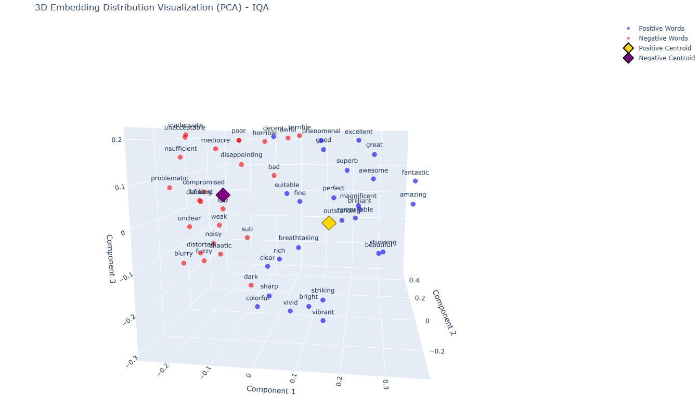
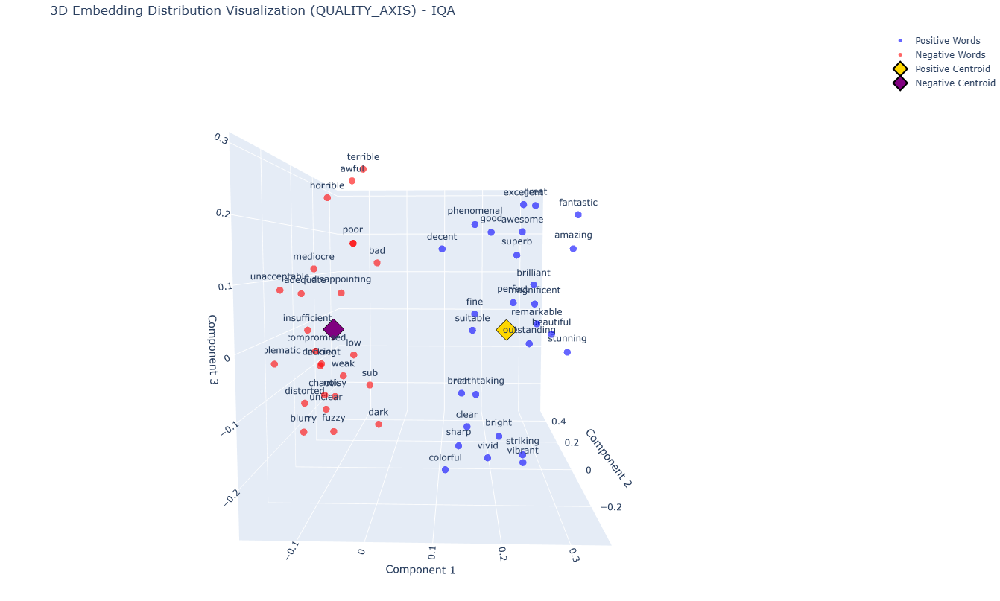

To verify the effectiveness of constructing the Quality Guidance Vector (QGV), we performed PCA dimensionality reduction visualization on word embedding vectors and further analyzed whether the QGV in the original method could correctly distinguish between positive and negative words in the quality space along the QGV direction. 

* The PCA visualization results showed that the mean of positive embedding vectors could largely represent the center of the positive cluster, and the same applied to the negative cluster.   
* During the experiments, we observed that negative quality words were divided into two clusters, suggesting the potential use of multiple QGVs for fine-grained attribute evaluation. Further exploration will be conducted in this direction.

Further visualization demonstrated that quality words could be well distinguished along the QGV direction.